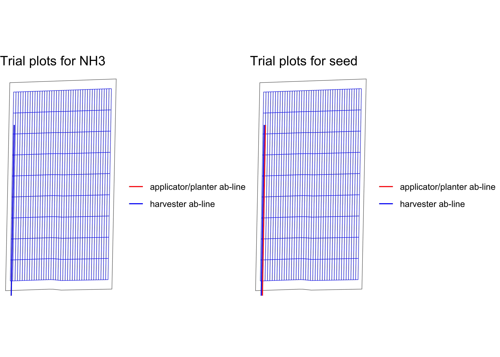

<!-- README.md is generated from README.Rmd. Please edit that file -->

# ofpetrial: Design On-farm Precision Experiments

<!-- badges: start -->
<!-- badges: end -->

The `ofpetrial` package allows the user to design agronomic input
experiments in a reproducible manner without using ArcGIS or QGIS.

## Installation

You can install the development version of ofpetrial from
[Github](https://github.com/DIFM-Brain/TrialDesign):

``` r
devtools::install_github("DIFM-Brain/ofpetrial")
```

## Example

Here, we demonstrate how to use the `ofpetrial` package to create
two-input on-farm experiment trial designs.

### Create experimental plots

We start with specifying plot and machine information for inputs using
`make_input_plot_data()`, which simply creates a data.frame of the
specified information with some interal unit conversion of length (feet
to meter).

``` r
seed_plot_info <-
  make_input_plot_data(
    form = "seed",
    plot_width = 30,
    machine_width = 60,
    section_num = 24,
    length_unit = "feet"
  )
#> Note: machine_width and plot_width are converted to meter as length_unit is specified as "feet".

seed_plot_info
#>   form plot_width machine_width
#> 1 seed      9.144        18.288
#>   section_num section_width
#> 1          24         0.762

n_plot_info <-
  make_input_plot_data(
    form = "NH3",
    plot_width = measurements::conv_unit(60, "ft", "m"),
    machine_width = measurements::conv_unit(60, "ft", "m"),
    section_num = 1
  )

n_plot_info
#>   form plot_width machine_width
#> 1  NH3     18.288        18.288
#>   section_num section_width
#> 1           1        18.288
```

Now that plot and machine specifications for the inputs are ready, we
can create experiment plots based on them using `make_exp_plots()`.

``` r
input_plot_info <- list(seed_plot_info, n_plot_info)

exp_data <-
  make_exp_plots(
    input_plot_info = input_plot_info,
    boundary_file = system.file("extdata", "boundary-simple1.shp", package = "ofpetrial"),
    abline_file = system.file("extdata", "ab-line-simple1.shp", package = "ofpetrial"),
    harvester_width = 30,
    abline_type = "free",
    headland_length = 30,
    side_length = 60,
    min_plot_length = 200,
    max_plot_length = 300,
    length_unit = "feet",
    perpendicular = FALSE
  )
#> Note: length arguments (e.g., harvester_width) are converted to meter as length_unit is specified as "feet".

exp_data$exp_plots
#> [[1]]
#> Simple feature collection with 1248 features and 3 fields
#> Geometry type: POLYGON
#> Dimension:     XY
#> Bounding box:  xmin: 352996.4 ymin: 4331451 xmax: 353368.6 ymax: 4332207
#> Projected CRS: WGS 84 / UTM zone 16N
#> First 10 features:
#>    plot_id strip_id poly_line
#> 1        1        1       1_1
#> 2        2        1       1_1
#> 3        3        1       1_1
#> 4        4        1       1_1
#> 5        5        1       1_1
#> 6        6        1       1_1
#> 7        7        1       1_1
#> 8        8        1       1_1
#> 9        9        1       1_1
#> 10      10        1       1_1
#>                          geometry
#> 1  POLYGON ((353005.5 4331451,...
#> 2  POLYGON ((353006 4331474, 3...
#> 3  POLYGON ((353006.5 4331497,...
#> 4  POLYGON ((353006.9 4331521,...
#> 5  POLYGON ((353007.4 4331544,...
#> 6  POLYGON ((353007.9 4331567,...
#> 7  POLYGON ((353008.4 4331590,...
#> 8  POLYGON ((353008.9 4331613,...
#> 9  POLYGON ((353009.3 4331637,...
#> 10 POLYGON ((353009.8 4331660,...
#> 
#> [[2]]
#> Simple feature collection with 608 features and 3 fields
#> Geometry type: POLYGON
#> Dimension:     XY
#> Bounding box:  xmin: 352996.4 ymin: 4331451 xmax: 353359.5 ymax: 4332206
#> Projected CRS: WGS 84 / UTM zone 16N
#> First 10 features:
#>    plot_id strip_id poly_line
#> 1        1        1       1_1
#> 2        2        1       1_1
#> 3        3        1       1_1
#> 4        4        1       1_1
#> 5        5        1       1_1
#> 6        6        1       1_1
#> 7        7        1       1_1
#> 8        8        1       1_1
#> 9        9        1       1_1
#> 10      10        1       1_1
#>                          geometry
#> 1  POLYGON ((353014.7 4331451,...
#> 2  POLYGON ((353015.1 4331474,...
#> 3  POLYGON ((353015.6 4331497,...
#> 4  POLYGON ((353016.1 4331521,...
#> 5  POLYGON ((353016.6 4331544,...
#> 6  POLYGON ((353017.1 4331567,...
#> 7  POLYGON ((353017.5 4331590,...
#> 8  POLYGON ((353018 4331614, 3...
#> 9  POLYGON ((353018.5 4331637,...
#> 10 POLYGON ((353019 4331660, 3...
```

We can visualize the layout of the experiment plots using `viz_ep()`.

``` r
viz_ep(exp_data)
```


### Assign rates

Let’s now assign input rates to the experimental plots we just created.
Before doing so, we need to prepare rate information for both inputs
using `make_input_rate_data()`.

``` r
#!===========================================================
#! Assign rates
#!===========================================================
seed_rate_info <-
  make_input_rate_data(
    seed_plot_info,
    gc_rate = 32000,
    unit = "seed",
    min_rate = 16000,
    max_rate = 40000,
    num_rates = 5,
    design_type = "jcl"
  )
#> Trial rates were not directly specified, so the trial rates were calculated using min_rate, max_rate, gc_rate, and num_rates

seed_rate_info
#>   form design_type gc_rate unit
#> 1 seed         jcl   32000 seed
#>                               rates_data
#> 1 100, 140, 180, 220, 260, 1, 2, 3, 4, 5
#>   rank_seq_ws rank_seq_as
#> 1        NULL        NULL

n_rate_info <-
  make_input_rate_data(
    plot_info = n_plot_info,
    gc_rate = 180,
    unit = "lb",
    rates = c(100, 140, 180, 220, 260),
    design_type = "jcl",
  )

n_rate_info
#>   form design_type gc_rate unit
#> 1  NH3         jcl     180   lb
#>                               rates_data
#> 1 100, 140, 180, 220, 260, 1, 2, 3, 4, 5
#>   rank_seq_ws rank_seq_as
#> 1        NULL        NULL
```

We can now use `assign_rates()` to assign rates to experiment plots.

``` r
trial_design <- assign_rates(exp_data, list(seed_rate_info, n_rate_info))
```

Here is the visualization of the trial design done by `viz_td()`.

``` r
viz_td(trial_design)
```


