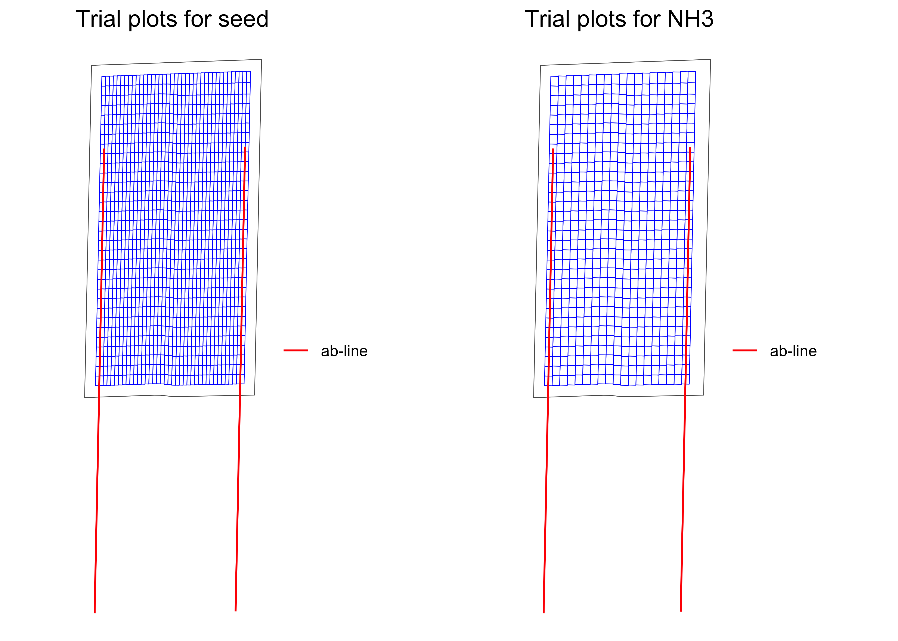

<!-- README.md is generated from README.Rmd. Please edit that file -->

# ofpetrial: Design On-farm Precision Experiments

<!-- badges: start -->
<!-- badges: end -->

The goal of ofpetrial is to …

## Installation

You can install the development version of ofpetrial from
[Github](https://github.com/DIFM-Brain/TrialDesign):

``` r
devtools::install_github("DIFM-Brain/ofpetrial")
```

## Example

### Create experimental plots

``` r
seed_plot_info <-
  make_input_plot_data(
    form = "seed",
    plot_width = 30,
    machine_width = 60,
    section_num = 24,
    length_unit = "feet"
  )
#> Note: machine_width and plot_width are converted to meter as length_unit is specified as "feet".

n_plot_info <-
  make_input_plot_data(
    form = "NH3",
    plot_width = measurements::conv_unit(60, "ft", "m"),
    machine_width = measurements::conv_unit(60, "ft", "m"),
    section_num = 1
  )

seed_plot_info
#>   form plot_width machine_width
#> 1 seed      9.144        18.288
#>   section_num section_width
#> 1          24         0.762
n_plot_info
#>   form plot_width machine_width
#> 1  NH3     18.288        18.288
#>   section_num section_width
#> 1           1        18.288
```

``` r
input_plot_info <- list(seed_plot_info, n_plot_info)

exp_data <-
  make_exp_plots(
    input_plot_info = input_plot_info,
    boundary_file = system.file("extdata", "boundary-simple1.shp", package = "ofpetrial"),
    abline_file = system.file("extdata", "ab-line-simple1.shp", package = "ofpetrial"),
    harvester_width = 30,
    abline_type = "free",
    headland_length = 30,
    side_length = 60,
    min_plot_length = 200,
    max_plot_length = 300,
    length_unit = "feet",
    perpendicular = FALSE
  )
#> Note: length arguments (e.g., harvester_width) are converted to meter as length_unit is specified as "feet".
```

``` r
viz_exp_plots(exp_data)
```



``` r
#!===========================================================
#! Assign rates
#!===========================================================
seed_rate_info <-
  make_input_rate_data(
    seed_plot_info,
    gc_rate = 32000,
    unit = "seed",
    min_rate = 16000,
    max_rate = 40000,
    num_rates = 5,
    design_type = "jcl"
  )
#> Trial rates were not directly specified, so the trial rates were calculated using min_rate, max_rate, gc_rate, and num_rates

n_rate_info <-
  make_input_rate_data(
    plot_info = n_plot_info,
    gc_rate = 180,
    unit = "lb",
    rates = c(100, 140, 180, 220, 260),
    design_type = "jcl",
  )

rate_info <- list(seed_rate_info, n_rate_info)

td <- assign_rates(exp_data, rate_info)
```

``` r
viz_td(td)
```


