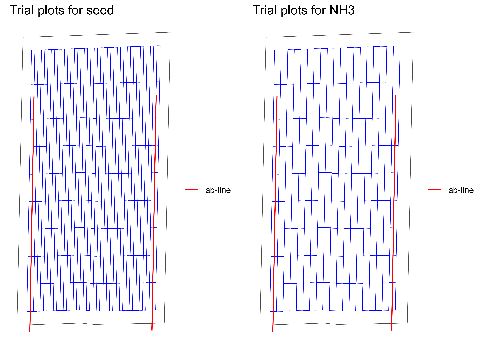
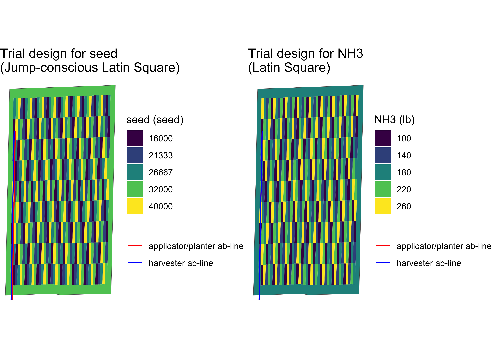

<!-- README.md is generated from README.Rmd. Please edit that file -->

# ofpetrial: Design On-farm Precision Experiments

<!-- badges: start -->

[](https://github.com/DIFM-Brain/ofpetrial/actions/workflows/R-CMD-check.yaml)
<!-- badges: end -->

The `ofpetrial` package allows the user to design agronomic input
experiments in a reproducible manner without using ArcGIS or QGIS.

## Installation

You can install the development version of ofpetrial from
[Github](https://github.com/DIFM-Brain/TrialDesign):

``` r
devtools::install_github("DIFM-Brain/ofpetrial")
library(ofpetrial)
```

## Example

Here, we demonstrate how to use the `ofpetrial` package to create
two-input on-farm experiment trial designs.

### Create experimental plots

We start with specifying plot and machine information for inputs using
`prep_plot_f()`, which simply creates a data.frame of the specified
information with some internal unit conversion of length (feet to
meter).

``` r
seed_plot_info <-
  prep_plot_f(
    input_name = "seed",
    machine_width = 60,
    section_num = 24,
    harvester_width = 30,
    plot_width = 30
  )
#> 

seed_plot_info
#> # A tibble: 1 × 10
#>   input_name machine_width section_num sectio…¹ harve…² plot_…³ headl…⁴ side_…⁵ min_p…⁶ max_p…⁷
#>   <chr>              <dbl>       <dbl>    <dbl>   <dbl>   <dbl>   <dbl>   <dbl>   <dbl>   <dbl>
#> 1 seed                18.3          24    0.762    9.14    9.14    36.6    9.14    73.2    91.4
#> # … with abbreviated variable names ¹​section_width, ²​harvester_width, ³​plot_width,
#> #   ⁴​headland_length, ⁵​side_length, ⁶​min_plot_length, ⁷​max_plot_length

n_plot_info <-
  prep_plot_f(
    input_name = "NH3",
    machine_width = 30,
    section_num = 1,
    harvester_width = 30,
    plot_width = 30
  )
#> 

n_plot_info
#> # A tibble: 1 × 10
#>   input_name machine_width section_num sectio…¹ harve…² plot_…³ headl…⁴ side_…⁵ min_p…⁶ max_p…⁷
#>   <chr>              <dbl>       <dbl>    <dbl>   <dbl>   <dbl>   <dbl>   <dbl>   <dbl>   <dbl>
#> 1 NH3                 9.14           1     9.14    9.14    9.14    18.3    9.14    73.2    91.4
#> # … with abbreviated variable names ¹​section_width, ²​harvester_width, ³​plot_width,
#> #   ⁴​headland_length, ⁵​side_length, ⁶​min_plot_length, ⁷​max_plot_length
```

Now that plot and machine specifications for the inputs are ready, we
can create experiment plots based on them using `make_exp_plots()`.

``` r
input_plot_info <- list(seed_plot_info, n_plot_info)

exp_data <-
  make_exp_plots(
    input_plot_info = input_plot_info,
    boundary_data = system.file("extdata", "boundary-simple1.shp", package = "ofpetrial"),
    abline_data = system.file("extdata", "ab-line-simple1.shp", package = "ofpetrial"),
    abline_type = "free"
  )
```

The experiment plots created by `make_exp_plots()` is stored in
`exp_plots`.

``` r
exp_data$exp_plots
#> [[1]]
#> Simple feature collection with 369 features and 3 fields
#> Geometry type: POLYGON
#> Dimension:     XY
#> Bounding box:  xmin: 352988.4 ymin: 4331460 xmax: 353376.6 ymax: 4332198
#> Projected CRS: WGS 84 / UTM zone 28N
#> First 10 features:
#>    plot_id strip_id poly_line                       geometry
#> 1        1        1       1_1 POLYGON ((352997.6 4331460,...
#> 2        2        1       1_1 POLYGON ((352999 4331540, 3...
#> 3        3        1       1_1 POLYGON ((353000.5 4331621,...
#> 4        4        1       1_1 POLYGON ((353001.9 4331702,...
#> 5        5        1       1_1 POLYGON ((353003.3 4331782,...
#> 6        6        1       1_1 POLYGON ((353004.8 4331863,...
#> 7        7        1       1_1 POLYGON ((353006.2 4331943,...
#> 8        8        1       1_1 POLYGON ((353007.7 4332024,...
#> 9        9        1       1_1 POLYGON ((353009.1 4332104,...
#> 10       1        2       1_1 POLYGON ((353006.7 4331460,...
#> 
#> [[2]]
#> Simple feature collection with 369 features and 3 fields
#> Geometry type: POLYGON
#> Dimension:     XY
#> Bounding box:  xmin: 352988.4 ymin: 4331460 xmax: 353376.6 ymax: 4332198
#> Projected CRS: WGS 84 / UTM zone 28N
#> First 10 features:
#>    plot_id strip_id poly_line                       geometry
#> 1        1        1       1_1 POLYGON ((352997.6 4331460,...
#> 2        2        1       1_1 POLYGON ((352999 4331540, 3...
#> 3        3        1       1_1 POLYGON ((353000.5 4331621,...
#> 4        4        1       1_1 POLYGON ((353001.9 4331702,...
#> 5        5        1       1_1 POLYGON ((353003.3 4331782,...
#> 6        6        1       1_1 POLYGON ((353004.8 4331863,...
#> 7        7        1       1_1 POLYGON ((353006.2 4331943,...
#> 8        8        1       1_1 POLYGON ((353007.7 4332024,...
#> 9        9        1       1_1 POLYGON ((353009.1 4332104,...
#> 10       1        2       1_1 POLYGON ((353006.7 4331460,...
```

`exp_data$exp_plots` is a list and you can access the individual
experiment plots (an `sf` object) like this.

``` r
exp_data$exp_plots[[1]]
#> Simple feature collection with 369 features and 3 fields
#> Geometry type: POLYGON
#> Dimension:     XY
#> Bounding box:  xmin: 352988.4 ymin: 4331460 xmax: 353376.6 ymax: 4332198
#> Projected CRS: WGS 84 / UTM zone 28N
#> First 10 features:
#>    plot_id strip_id poly_line                       geometry
#> 1        1        1       1_1 POLYGON ((352997.6 4331460,...
#> 2        2        1       1_1 POLYGON ((352999 4331540, 3...
#> 3        3        1       1_1 POLYGON ((353000.5 4331621,...
#> 4        4        1       1_1 POLYGON ((353001.9 4331702,...
#> 5        5        1       1_1 POLYGON ((353003.3 4331782,...
#> 6        6        1       1_1 POLYGON ((353004.8 4331863,...
#> 7        7        1       1_1 POLYGON ((353006.2 4331943,...
#> 8        8        1       1_1 POLYGON ((353007.7 4332024,...
#> 9        9        1       1_1 POLYGON ((353009.1 4332104,...
#> 10       1        2       1_1 POLYGON ((353006.7 4331460,...
```

We can visualize the layout of the experiment plots using
`viz_layout()`.

``` r
viz(exp_data, type = "layout")
```



### Assign rates

Let’s now assign input rates to the experimental plots we just created.
Before doing so, we need to prepare rate information for both inputs
using `prep_rates()`.

``` r
#!===========================================================
# ! Assign rates
# !===========================================================
seed_rate_info <-
  prep_rate(
    plot_info = seed_plot_info,
    gc_rate = 32000,
    unit = "seed",
    min_rate = 16000,
    max_rate = 40000,
    num_rates = 5,
    design_type = "jcls"
  )
#> Trial rates were not directly specified via the {rates} option, so the trial rates will be calculated using min_rate, max_rate, gc_rate, and num_rates

seed_rate_info
#> # A tibble: 1 × 10
#>   input_name design_type gc_rate unit  rates  min_rate max_rate num_rates rank_seq_ws rank_se…¹
#>   <chr>      <chr>         <dbl> <chr> <list>    <dbl>    <dbl>     <dbl> <list>      <list>   
#> 1 seed       jcls          32000 seed  <NULL>    16000    40000         5 <NULL>      <NULL>   
#> # … with abbreviated variable name ¹​rank_seq_as

n_rate_info <-
  prep_rate(
    plot_info = n_plot_info,
    gc_rate = 180,
    unit = "lb",
    rates = c(100, 140, 180, 220, 260),
    design_type = "ls",
    rank_seq_ws = c(5, 4, 3, 2, 1)
  )

n_rate_info
#> # A tibble: 1 × 10
#>   input_name design_type gc_rate unit  rates     min_rate max_rate num_rates rank_seq…¹ rank_…²
#>   <chr>      <chr>         <dbl> <chr> <list>    <lgl>    <lgl>        <dbl> <list>     <list> 
#> 1 NH3        ls              180 lb    <dbl [5]> NA       NA               5 <dbl [5]>  <NULL> 
#> # … with abbreviated variable names ¹​rank_seq_ws, ²​rank_seq_as
```

We can now use `assign_rates()` to assign rates to experiment plots (see
[this
vignette](https://difm-brain.github.io/ofpetrial/articles/V1-trial-design-options.html)
for other design options and [this
vignette](https://difm-brain.github.io/ofpetrial/articles/V3-change-rates-manually.html)
for changing rates manually.).

``` r
trial_design <- assign_rates(exp_data, rate_info = list(seed_rate_info, n_rate_info))
#> Trial rates were not directly specified, so the trial rates were calculated using min_rate, max_rate, gc_rate, and num_rates
```

Here is the visualization of the trial design done by `viz`.

``` r
viz(trial_design)
```



Along with the spatial pattern of the input rates, the
applicator/planter ab-line and harvester ab-line are drawn by default.

### Diagnose the trial design

The `ofpetrial` package offers several functions to check the soundness
of a trial design (see [this
vignette](https://difm-brain.github.io/ofpetrial/articles/V4-diagnose-td.html)
for more details and examples).

Let’s check if the seed and NH3 rates has very little correlationl.

``` r
(
  cor_inputs <- check_ortho_inputs(trial_design)
)
#> Checking the correlation between the two inputs. This may take some time depending on the number of experiment plots.
#> [1] 0.3405442
```

The correlation coefficient is 0.34.

### Write the trial design files for implementation

Once you are satisfied with the trial design adn the location of the
ab-lines, you can write out all the necessary files as shape files for
the machine operators to actually implement the trial.

``` r
write_trial_files(td, zip = TRUE, zip_name = "td-collection")
```

Here, all the shape files (trial dsign, applicator/planter ab-line, and
harvester ab-line) are packed in a zipped folder, named
“td-collection.zip”.

# Acknowledgement

This project was funded in part by a United States Department of
Agriculture—National Institute of Food and Agriculture (USDA—NIFA) Food
Security Program Grant (Award Number 2016-68004-24769) and by United
States Department of Agriculture (USDA) -Natural Resources Conservation
Service (NRCS), Commodity Credit Corporation (CCC), Conservation
Innovation Grants On-Farm Conservation Innovation Trials (Award Number
USDA-NRCS-NHQ-CIGOFT-20-GEN0010750).
